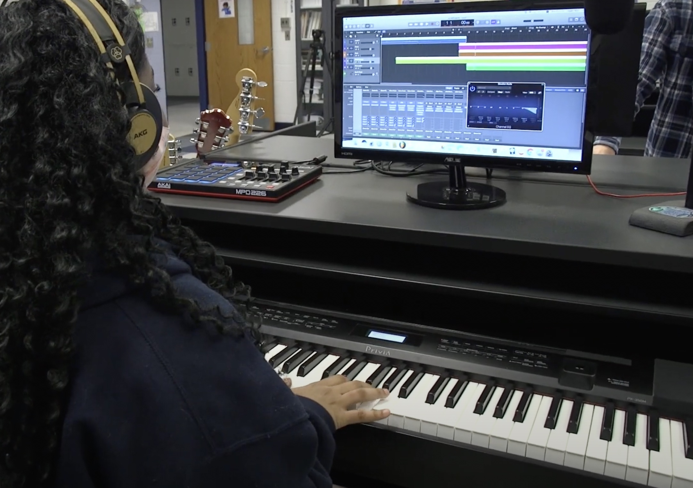

## 👋 Hi, I’m Mrs. Levy

My name is Sophia Levy. I was born in Indonesia. I moved to Vancouver, Canada when I was 17 to finish high school.

I received my Bachelor of Music degree from Berklee College of Music in Boston, where I majored in Music Synthesis.

The program covered the whole spectrum of music technology, including songwriting, recording, producing, and performing.

One of my favorite memories from Berklee was winning a songwriting contest and performing it at the Berklee Performance Center.

Fun fact: my bass player for that show went on to join John Mayer’s band!

## Industry experience

Photo by <a href="https://unsplash.com/@ndrf?utm_source=unsplash&utm_medium=referral&utm_content=creditCopyText">Andreas Niendorf</a> on <a href="https://unsplash.com/photos/l8ypMiU1Hio?utm_source=unsplash&utm_medium=referral&utm_content=creditCopyText">Unsplash</a>

- After graduating from Berklee, I got to experience many different areas of the music business.
- I moved to New York City and started a production company with my husband.

That was me with my old Mac and Logic Audio. I was writing, collaborating, and producing 24/7. I played around with Logic before you were born! 

Songwriter, Producer, Recording Artist, Performer…

- This is my Indonesian album.
- I wrote and produced this album in our studio in New York and got a record deal.
- This album was where I wore many hats in the music business. I was the songwriter, producer, recording artist, and performer. 

- For the album promo, I performed live and on TV.

- I did a lot of interviews on radio stations, newspapers, magazines, and television shows, including MTV Asia.
- But before I did all that rock star stuff, I was doing this!

- I starred in a kids’ TV show in Singapore called KCTV WOW, and I wrote and recorded all the music for that too. 
- We were like the Asian version of "The Wiggles".

- During the filming of the episodes, we also performed live for our little fans.

## My parents

- I was really grateful that my parents were there and so supportive of me. They were very proud.

## Television

- Another avenue I explored as a published songwriter was writing and recording many songs for television. A lot of my songs were featured in daytime TV such as ABC, CBS, NBC, and Bravo. 

## Film & Recording Artists

- One of my songs was placed in Woody Allen's movie, called Cassandra's Dream. It was a dance track I collaborated on with 2 other writers from the publishing company I was affiliated with.
- I also wrote songs for other professional recording artists on some major labels such as Sony and BMG.

## Well-Rounded Musician

Photo by <a href="https://unsplash.com/@sammoghadamkhamseh?utm_source=unsplash&utm_medium=referral&utm_content=creditCopyText">Sam Moghadam Khamseh</a> on <a href="https://unsplash.com/photos/-_lqROGc6lE?utm_source=unsplash&utm_medium=referral&utm_content=creditCopyText">Unsplash</a>

- So, why am I talking about myself and telling you all what I've done in the past? Obviously first I wanna introduce myself to you, and that I'm so happy to be here!
- Because of what I've learned at Berklee, the whole spectrum of Music Technology that includes songwriting, performing, producing and understanding the technology behind the writing and the performing aspects, I was able to experience all the different roles in the music industry. 
- Great news, in this Music Technology class, you will learn how to become a well rounded musician!

## Teaching experience

For the past 12 years, I’ve been teaching piano, voice, and performance out of my own music studio. 

My students and I have done many fun activities together:

- performing in cafés, clubs, restaurants, and festivals

- participating in competitions (this girl won the Vienna Idol contest)

- participating in pop-rock band workshops

- recording original music in local studios
- AND learning how to use digital audio workstations

A few years ago, I produced a benefit concert with a charity organization called Giving On Another Level. We did an 80's Throwback, Back-To-School Benefit Concert, to raise money for getting school supplies for Yorkshire Elementary, a title-one school in Manassas. 

We raised almost $20,000 that night. We could send all 857 students back to school with all the required supplies needed for their upcoming year. It was such an amazing show! A lot of hard work, collaboration, and dedication that was put into creating this show.

Stuffing backpacks day! And the beautiful thank you notes from the students.

## Coming to Colgan

- A couple years ago, I was invited by Mr. Mills to host a masterclass on songwriting and project feedback, and I was so impressed with the talent of the students here and the work they were doing.
- So when the opportunity came up to be the new Music Tech teacher at CFPA, and continue the amazing work that Mr. Mills started, I knew this was where I needed to be.

## Next Chapter

- This is an exciting time for you to be joining this program now because you and I are starting our journey at Colgan together! So we’ll be collaborating to further develop the study and practice of music technology within CFPA and take it to the next level.
- We’re really fortunate because we have an amazing community here of talented, supportive, and creative students, teachers, administrators, and staff. We’re all here to learn from each other and make beautiful music together!

Photo by <a href="https://unsplash.com/@sasotusar?utm_source=unsplash&utm_medium=referral&utm_content=creditCopyText">Sašo Tušar</a> on <a href="https://unsplash.com/photos/QtgGYlug6Cw?utm_source=unsplash&utm_medium=referral&utm_content=creditCopyText">Unsplash</a>

## So, what are we going to do in this class? 

- If you look at the name, Music Technology, we are basically going to do the Music and the Technology! What does that mean?
- We will be learning Music Writing and Music Performance. And, the technology to support both areas. 
- We'll use the Digital Audio Workstation to support the music writing part. And the Live Audio Engineering will support the Music Performance part. Technology allows our music to reach more people and gives a great live music experience. You are going to be learning all of those subjects in this class. 

## Let's Make Music!

Photo by <a href="https://unsplash.com/@pear?utm_source=unsplash&utm_medium=referral&utm_content=creditCopyText">Pierre Gui</a> on <a href="https://unsplash.com/photos/YcUE3rmWGMM?utm_source=unsplash&utm_medium=referral&utm_content=creditCopyText">Unsplash</a>

- We are going to have an amazing time together! Welcome to Music Technology!

