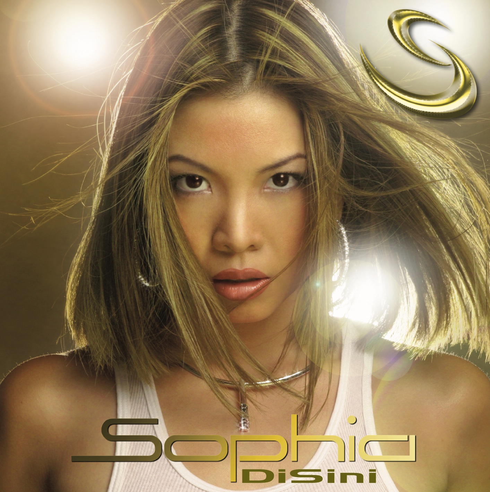
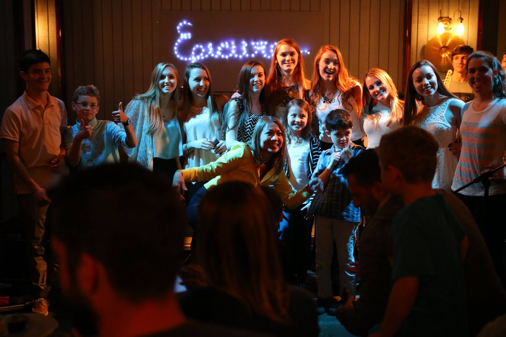
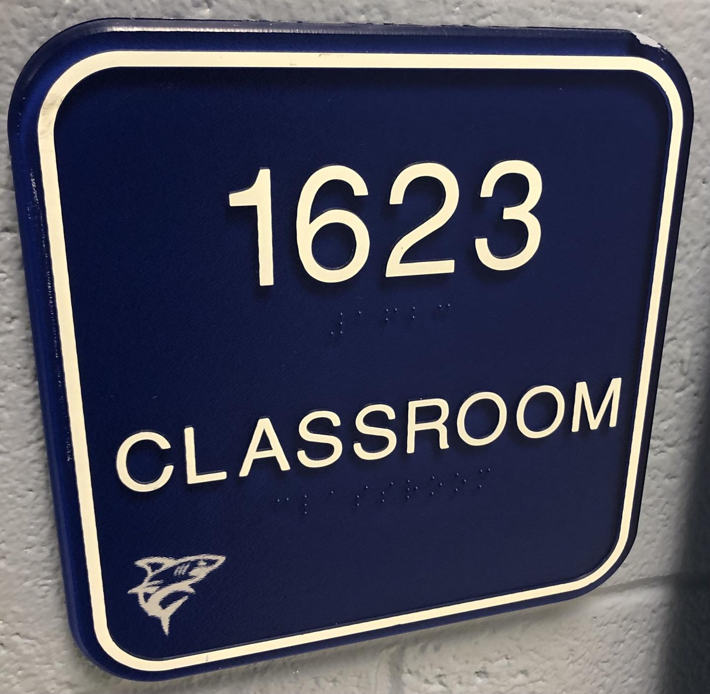
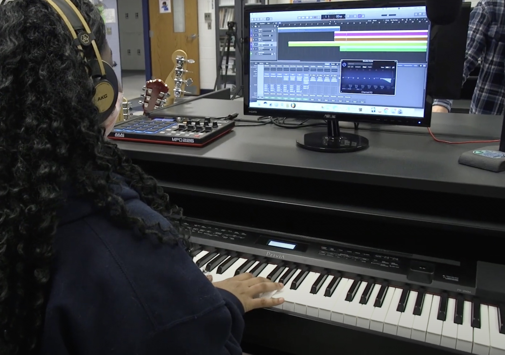

# 👋
# Hi, I’m Mrs. Levy

My name is Sophia Levy. I was born in Indonesia. I moved to Vancouver, Canada when I was 17 to finish high school.

I received my Bachelor of Music degree from Berklee College of Music in Boston, where I majored in Music Synthesis.

The program covered the whole spectrum of music technology, including songwriting, recording, producing, and performing.

One of my favorite memories from Berklee was winning a songwriting contest and performing it at the Berklee Performance Center.

Fun fact: my bass player for that show went on to join John Mayer’s band!

---

# Industry experience

After graduating from Berklee, I got to experience many different areas of the music business.

- I moved to New York and started a production company with my husband.
- I wrote and recorded many songs for television.
- I produced my own Indonesian-language album.
- I wrote songs for other professional recording artists.
- AND I starred in a kids’ show in Singapore and wrote and recorded all the music for that.

---
# Teaching experience

Background: images/true

For the past 12 years, I’ve been teaching piano, voice, and performance out of my own music studio. 

My students and I have done many fun activities together:
- performing in cafés, clubs, restaurants, festivals, competitions, and benefit concerts
- participating in pop-rock band workshops
- recording original music in local studios
- AND learning how to use digital audio workstations

---

# Coming to Colgan
A couple years ago, I was invited by Mr. Mills to host a masterclass on songwriting and project feedback, and I was so impressed with the talent of the students here and the work they were doing.

So when the opportunity came up to be the new Music Tech teacher at CFPA, and continue the amazing work that Mr. Mills started, I knew this was where I needed to be.

---
# Next Chapter

This is an exciting time for you to be joining this program now because you and I are starting our journey at Colgan together! So we’ll be collaborating to further develop the study and practice of music technology within CFPA and taking it to the next level.

We’re really fortunate because we have an amazing community here of talented, supportive, and creative students, teachers, administrators, and staff. We’re all here to learn from each other and make beautiful music together!

---
# So, what are we going to do in this class? 

If you look at the name, Music Technology, we are basically going to do the Music and the Technology! What does that mean?

We will be learning Music Writing and Music Performance. And, the technology to support both areas. 

We'll use the Digital Audio Workstation to support the music writing part. And the Live Audio Engineering will support the Music Performance part. Technology allows our music to reach more people and gives great live music experience. You are going to be learning all of those subjects in this class. 

---
# Thanks for coming!

We are going to have an amazing time together! Welcome to Music Technology!
